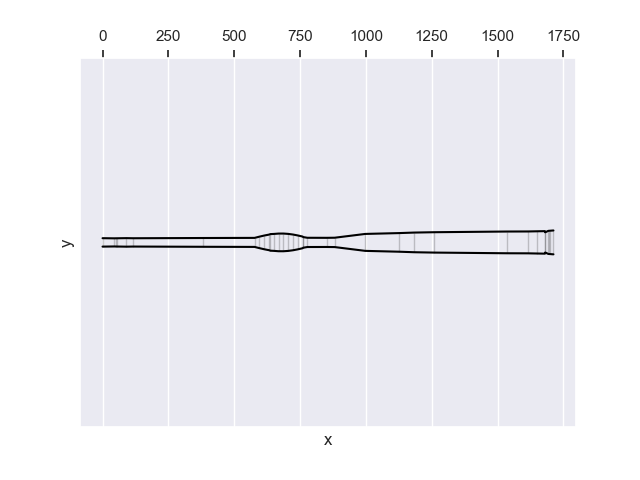

# Arusha

Arusha (key: D) was designed as a didgeridoo with many toots that are well tuned. It is also loud and easy to play. I built it in a bend, saxodidge like shape. Unfortunately the tuning is a bit off. It is half-way between D and D#. Still, it is the main instrument that I use.

[Here is information how to read the technical information below.](/2025/02/13/how-to-read-outputs-of-didgelab.html)

<audio controls>
    <source src="arusha-short-song.mp3" type="audio/mp3">
    Your browser does not support the audio element.
</audio>

## Geometry

* Length: 1712mm
* Mouthpiece diameter: 32mm
* Bell diameter: 91

[Download JSON](geo.json)

    
## Sonic properties

### Resonant frequencies

<table class="analysis_table">
<tr class='even'><td><strong>
Note Name</strong></td>
<td><strong>Frequency</strong></td>
<td><strong>Tuning (in Cent)</strong></td>
<td><strong>Relative Impedance</strong>
</td></tr>
<tr><td>
D1</td>
<td>73.52</td>
<td>2.37</td>
<td>1.0
</td></tr>
<tr class="even"><td>
D2</td>
<td>146.19</td>
<td>-7.63</td>
<td>0.42
</td></tr>
<tr><td>
A3</td>
<td>220.3</td>
<td>2.37</td>
<td>0.53
</td></tr>
<tr class="even"><td>
F3</td>
<td>349.71</td>
<td>2.37</td>
<td>0.02
</td></tr>
<tr><td>
A4</td>
<td>440.6</td>
<td>2.37</td>
<td>0.76
</td></tr>
<tr class="even"><td>
F4</td>
<td>695.38</td>
<td>-7.63</td>
<td>0.27
</td></tr>
<tr><td>
B5</td>
<td>989.12</td>
<td>2.37</td>
<td>0.08
</td></tr>

</table>

## License
[Creative Commons BY-NC-SA 4.0 License](https://creativecommons.org/licenses/by-nc-sa/4.0/deed.en)