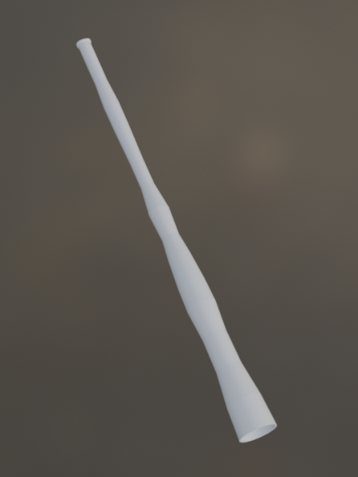
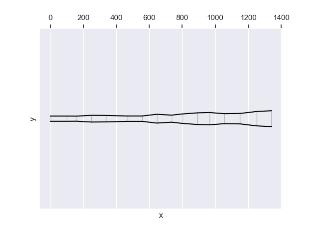

# Malveira

Malveira is a Didge in F# that was designed after a Didgeridoo that I found in the internet and liked. I will write a blog article soon about it.

[This is the youtube video of the original Didgeridoo which I used to guide the acoustic copy (black euca didge, starting at 3:29).](https://www.youtube.com/watch?v=Ff0EH5s9P-0&t=212s)

[Here is information how to read the technical information below.](/2025/02/13/how-to-read-outputs-of-didgelab.html)

<audio controls>
    <source src="malveira-short-song.mp3" type="audio/mp3">
    Your browser does not support the audio element.
</audio>

## Geometry

* Length: 1341mm
* Mouthpiece diameter: 32mm
* Bell diameter: 97

[Download JSON](geo.json)

    
## Sonic properties

### Resonant frequencies

<table class="analysis_table">
<tr class='even'><td><strong>
Note Name</strong></td>
<td><strong>Frequency</strong></td>
<td><strong>Tuning (in Cent)</strong></td>
<td><strong>Relative Impedance</strong>
</td></tr>
<tr><td>
F#1</td>
<td>92.09</td>
<td>-7.63</td>
<td>1.0
</td></tr>
<tr class="even"><td>
F#2</td>
<td>184.18</td>
<td>-7.63</td>
<td>0.26
</td></tr>
<tr><td>
F3</td>
<td>349.71</td>
<td>2.37</td>
<td>0.2
</td></tr>
<tr class="even"><td>
A#4</td>
<td>464.11</td>
<td>-7.63</td>
<td>0.19
</td></tr>
<tr><td>
F#4</td>
<td>741.0</td>
<td>2.37</td>
<td>0.04
</td></tr>

</table>

## License
[Creative Commons BY-NC-SA 4.0 License](https://creativecommons.org/licenses/by-nc-sa/4.0/deed.en)