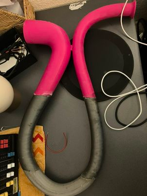
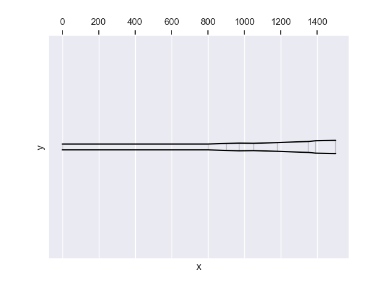
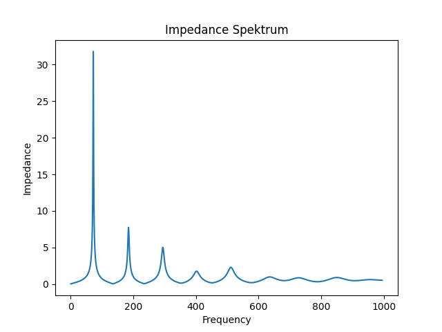
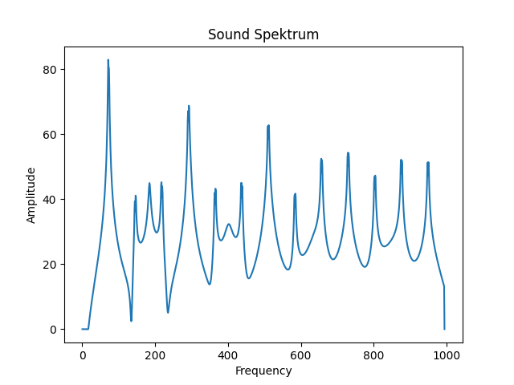

# Open Didgeridoo

This Didgeridoo (key: D) was built after the [Open Didgeridoo](https://www.windproject.it/open-didgeridoo/) designed by [Andrea Ferroni](http://www.andreaferroni.it/).

<iframe width="560" height="315" src="https://www.youtube.com/embed/Yjmut_38P04?si=S6LDNNXZ9iIpxcVf" title="YouTube video player" frameborder="0" allow="accelerometer; autoplay; clipboard-write; encrypted-media; gyroscope; picture-in-picture; web-share" referrerpolicy="strict-origin-when-cross-origin" allowfullscreen></iframe>

<audio controls>
    <source src="opendidge-short-song.mp3" type="audio/mp3">
    Your browser does not support the audio element.
</audio>

## Basic info

* Tuning: D
* Length: 1500mm
* Mouthpiece diameter: 32mm
* Bell diameter: 72

[Download shape as JSON](geo.json)

[Download STL files for 3D printing from Thingiverse](https://www.thingiverse.com/thing:7014774)

    
## Sonic properties
    
[Here is information how to read these technical information.](/2025/02/13/how-to-read-outputs-of-didgelab.html)

### Resonant frequencies

<table class="analysis_table">
<tr class='even'><td><strong>
Note Name</strong></td>
<td><strong>Frequency</strong></td>
<td><strong>Tuning (in Cent)</strong></td>
<td><strong>Relative Impedance</strong>
</td></tr>
<tr><td>
D1</td>
<td>72.67</td>
<td>-17.63</td>
<td>1.0
</td></tr>
<tr class="even"><td>
F#2</td>
<td>185.25</td>
<td>2.37</td>
<td>0.24
</td></tr>
<tr><td>
D3</td>
<td>294.07</td>
<td>2.37</td>
<td>0.16
</td></tr>
<tr class="even"><td>
G3</td>
<td>401.71</td>
<td>42.37</td>
<td>0.05
</td></tr>
<tr><td>
C4</td>
<td>512.0</td>
<td>-37.63</td>
<td>0.07
</td></tr>
<tr class="even"><td>
D#4</td>
<td>637.67</td>
<td>42.37</td>
<td>0.03
</td></tr>
<tr><td>
F#4</td>
<td>728.27</td>
<td>-27.63</td>
<td>0.03
</td></tr>
<tr class="even"><td>
G#4</td>
<td>851.19</td>
<td>42.37</td>
<td>0.03
</td></tr>
<tr><td>
A#5</td>
<td>955.43</td>
<td>42.37</td>
<td>0.02
</td></tr>

</table>

## License
[Open Didgeridoo License](https://www.windproject.it/open-didgeridoo/)